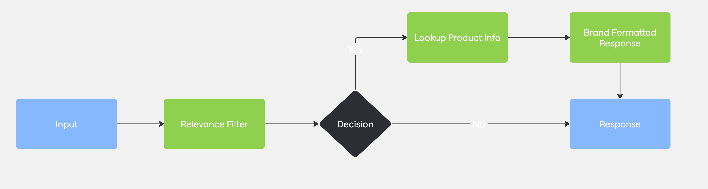

# LLM Composition Patterns

A practical demonstration of LLM workflow patterns and agent architectures inspired by Anthropic's "Building Effective Agents" article.

## Overview

This project offers interactive examples and implementations of LLM workflow patterns and agent architectures, drawing inspiration from Anthropic's blog post ["Building Effective Agents"](https://www.anthropic.com/engineering-at-anthropic/building-effective-agents) (December 2024) and resources like [Agent Recipes](https://www.agentrecipes.com/).

All examples are built around [KETL Mtn. Apparel](https://ketlmtn.com), a focused outdoor apparel company known for their "Pack Light. Do More." philosophy. Using their product catalog (stored in `common/ketlmtn_data/`), we demonstrate how different LLM patterns solve real challenges in e-commerce, from customer service and content creation to quality control and global market reach. The example implementations use Python 3.12+, Groq's LLM API, and Arize Phoenix for tracing and observability.

## Patterns

The repository includes the following patterns:

### [Prompt Chaining](src/llm_composition_patterns/patterns/prompt_chaining/)
Creating a workflow where the output of one LLM call becomes the input for the next, forming a sequential chain. In KETL Mtn.'s customer service, this handles queries like "I need a comfortable pair of pants that I can hike in but also wear to casual office work" by first filtering for relevance (suggesting the Tomfoolery Chino Travel Pants), then looking up specific product details (stretchy fabric, zipper pockets, stain resistance), and finally formatting a helpful response.



### [Parallelization](src/llm_composition_patterns/patterns/parallelization/)
Executing multiple LLM tasks concurrently to reduce total processing time. For KETL Mtn.'s global expansion, this pattern efficiently translates product descriptions (like their popular Nofry Sun Hoodie UPF 30+) into multiple languages simultaneously, ensuring consistent messaging across markets without creating content bottlenecks.


### [Routing](src/llm_composition_patterns/patterns/routing/)
Directing user queries to specialized handlers based on the type of information requested. When customers ask about the lifetime repair program for their Vent Lightweight Active Pants, sizing details for the Alpine Dip-N-More Boardshorts, or KETL Mtn.'s sustainability practices, this pattern ensures questions reach the appropriate knowledge base and specialist handler.


### [Evaluator-Optimizer](src/llm_composition_patterns/patterns/evaluator_optimizer/)
Implementing an iterative improvement cycle where content is repeatedly generated, evaluated, and refined. This pattern helps KETL Mtn. create compelling sales pitches by iteratively generating and refining content until it perfectly balances persuasiveness with their "Built for Adventure. Designed for Everyday." brand voice. For example, generating a sales pitch for their Tomfoolery Chino Travel Pants that highlights both technical features and lifestyle benefits while maintaining brand authenticity.


### [Orchestrator-Workers](src/llm_composition_patterns/patterns/orchestrator_workers/) (In Development)
Using a coordinator LLM to manage a team of specialized worker LLMs. Pattern concept developed, implementation being refined for efficiency.

### [Autonomous Agent](src/llm_composition_patterns/patterns/autonomous_agent/) (Coming Soon)
Advanced pattern combining multiple approaches for more autonomous decision-making and task execution. Currently in development.

## Getting Started

### Prerequisites

- Python 3.12+
- [uv](https://github.com/astral-sh/uv) for package management
- Groq API key

### Installation

1. Clone the repository:
   ```bash
   git clone https://github.com/yourusername/llm-composition-patterns.git
   cd llm-composition-patterns
   ```

2. Create and activate a virtual environment:
   ```bash
   uv venv .venv
   source .venv/bin/activate  # On Windows: .venv\Scripts\activate
   ```

3. Install dependencies:
   ```bash
   uv add -r requirements.txt
   ```

4. Set up environment variables:
   ```bash
   cp .env.example .env
   # Edit .env to add your API keys
   ```

### Running an Example

Choose a pattern and run its example:

```bash
# Example for the Parallelization pattern
python -m src.llm_composition_patterns.patterns.parallelization.example
```

## Project Structure

- `src/llm_composition_patterns/`
  - `patterns/`: Implementation of different patterns
    - `parallelization/`: Parallelization pattern
    - `prompt_chaining/`: Prompt chaining pattern
    - `routing/`: Routing pattern
    - `evaluator_optimizer/`: Evaluator-optimizer pattern
    - `orchestrator_workers/`: Orchestrator-workers pattern (coming soon)
  - `common/`: Shared utilities and models
    - `groq_helpers.py`: Helper functions for Groq API
    - `models.py`: Shared Pydantic models
    - `ketlmtn_helpers.py`: Utilities for KETL Mtn. examples
    - `arize_phoenix_setup.py`: Tracing setup
    - `ketlmtn_data/`: Sample data files

## Tracing and Observability

All examples use OpenTelemetry with Arize Phoenix for tracing. To view traces:

1. Set up your Phoenix API key in the `.env` file
2. Run any example
3. View traces in the [Arize Phoenix dashboard](https://app.phoenix.arize.com/)

For local development, you can also run Phoenix locally:

```bash
docker run -p 6006:6006 arizephoenix/phoenix:latest
```

## License

This project is licensed under the MIT License - see the LICENSE file for details.
