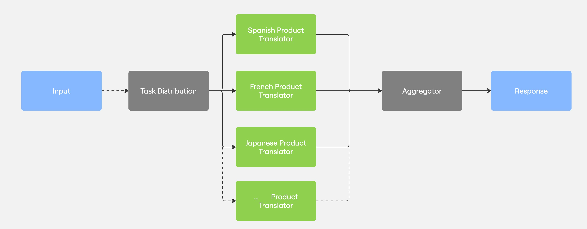

# Parallelization Pattern

## Overview

The Parallelization pattern executes multiple LLM tasks simultaneously, reducing overall processing time. This pattern is useful when a task can be broken down into independent subtasks that don't rely on each other's outputs. By running these tasks in parallel rather than sequentially, the system can provide faster responses, especially for complex operations.



## Implementation Details

This example demonstrates the parallelization pattern by translating KETL Mtn. Apparel product details into multiple languages simultaneously:

- Uses `asyncio.gather()` to run multiple translations in parallel
- Maintains original product names while translating other details
- Handles all translations with a consistent, fast model (llama-3.1-8b-instant)
- Includes comprehensive tracing with Arize Phoenix for observability
- Employs shared Pydantic models for robust data validation

## Key Components

### Translation Stage
- `translate_product_details()`: Translates a single product's details into a specific language
- Preserves the original product name (not translated) while translating features, fabric details, etc.

### Parallel Execution
- `translate_product()`: Orchestrates multiple parallel translations using `asyncio.gather()`
- Creates translation tasks for each language and executes them simultaneously
- Records performance metrics like total time and average time per language

### Result Collection
- The main function displays comprehensive results showing original and translated content
- Provides clear performance statistics to demonstrate the time savings
- Optionally exports results to JSON for further processing

## Tracing and Observability

This implementation includes robust OpenTelemetry tracing with Arize Phoenix integration:
- The parent span `translate_product_{product_id}` captures the overall process
- Child spans for each language translation (`translate_to_spanish`, etc.)
- Key metrics like response lengths and translation success tracked as span attributes
- Performance statistics (total time, average time per language) recorded for analysis

## Usage

Run the example with a specific product ID and languages:

```bash
python -m src.llm_composition_patterns.patterns.parallelization.example --product 5 --languages spanish french german
```

Default settings:
- Product ID: 1
- Languages: Spanish, French, German

## Why This Pattern Matters

The Parallelization pattern is particularly valuable when:

- Multiple independent operations need to be performed
- Response time is critical for user experience
- Tasks have similar complexity and structure
- Throughput is more important than sequential processing

This pattern demonstrates how to efficiently handle multiple translation tasks while providing clear performance metrics and comprehensive tracing for monitoring and analysis.

## Features

- **Concurrent Processing**: Executes multiple translations simultaneously
- **Model Specialization**: Uses different models optimized for specific language groups
- **Efficient Resource Usage**: Reduces overall processing time compared to sequential execution
- **Scalable Design**: Easily handles multiple products and languages

## Benefits

- **Reduced Latency**: Significantly decreases total processing time
- **Improved Throughput**: Processes more translations in less time
- **Resource Optimization**: Makes efficient use of API rate limits
- **Enhanced User Experience**: Provides faster responses for complex operations

## Limitations

- **API Rate Limits**: May hit provider rate limits with too many concurrent requests
- **Resource Intensive**: Requires more memory to manage multiple concurrent tasks
- **Error Handling Complexity**: Must properly manage failures in parallel tasks
- **Dependency Management**: Only works for tasks that don't depend on each other's outputs

## Example Interactions

### Product Translation Example
