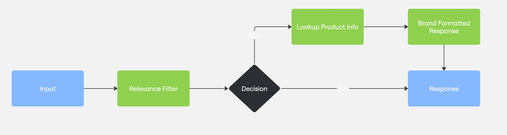

# Prompt Chaining Pattern

## Overview

The Prompt Chaining pattern creates a workflow where the output of one LLM call becomes the input for the next, forming a chain of prompts that work together to solve complex tasks. This pattern is useful when a task can be broken down into discrete steps that build upon each other.



## Implementation Details

This example demonstrates a 3-step prompt chain for a KETL Mtn. Apparel customer service chatbot:

1. **Query Relevance Filter** (`step1_filter_query_relevance`): Uses a quick model to determine if the query is relevant to KETL Mtn. products or outdoor activities.
2. **Product Information Lookup** (`step2_lookup_product_info`): Searches a product database to find relevant information based on the customer's query.
3. **Brand Format Response** (`step3_brand_format_response`): Rewrites the product information in KETL Mtn.'s brand voice to create a concise, on-brand response.

Each step is instrumented with OpenTelemetry tracing spans for comprehensive observability through Arize Phoenix.

## Key Components

### Initial Filtering Stage
- Validates query relevance to avoid processing inappropriate or off-topic queries
- Returns a boolean result and justification
- Uses the same model as other steps but with a specialized prompt

### Information Lookup Stage
- Searches through product database based on customer query
- Incorporates conversation history for context in follow-up questions
- Returns detailed product information that matches the query

### Response Formatting Stage
- Transforms technical product information into conversational responses
- Applies KETL Mtn.'s brand voice guidelines
- Creates concise, friendly answers that maintain brand identity

## Tracing and Observability

The implementation includes comprehensive OpenTelemetry tracing with Arize Phoenix integration:
- Parent span for the overall query processing
- Individual spans for each of the three steps in the chain
- Key attributes recorded at each stage (query relevance, response length, etc.)
- Clear visualization of the chaining pattern in trace views

## Usage

Run the example with the prompt chaining pattern:

```bash
python -m src.llm_composition_patterns.patterns.prompt_chaining.example
```

The example runs with sample queries to demonstrate the pattern but can be modified to accept custom input.

## Why This Pattern Matters

The Prompt Chaining pattern is particularly valuable when:

- Complex tasks require multiple steps of processing
- Different subtasks have specific requirements
- There's a logical sequence to the processing steps
- Results need to be refined or transformed before presentation

This pattern demonstrates how breaking down complex queries into sequential steps can lead to more accurate, contextual, and on-brand responses, all while maintaining clear observability through comprehensive tracing.

## Key Components

- **`example.py`**: Main implementation of the prompt chaining pattern
- **`ketlmtn_products.json`**: Product database with details about KETL Mtn. products
- **`brand_voice.txt`**: Guidelines for KETL Mtn.'s brand voice and tone
- **`message_types.py`**: Common message type definitions for LLM interactions
- **`groq_helpers.py`/`fireworks_helpers.py`**: Helper functions for interacting with LLM providers

## Features

- **Modular Design**: Each step in the chain has a specific purpose and can be modified independently
- **Conversation History**: Maintains context across multiple interactions
- **Provider Flexibility**: Works with different LLM providers (Groq, Fireworks)
- **Concise Responses**: Optimized for chat-like interactions with brief, focused answers
- **OpenTelemetry Tracing**: Includes spans for monitoring and debugging each step of the chain

## Benefits

- **Decomposition**: Breaks complex tasks into manageable steps
- **Specialization**: Each step uses a model optimized for that specific task
- **Early Filtering**: Initial relevance filter screens out inappropriate or unrelated queries
- **Maintainability**: Each step can be updated independently
- **Performance Optimization**: Uses smaller/faster models for simpler tasks and more capable models where needed

## Limitations

- **Latency**: Multiple API calls increase response time
- **Error Propagation**: Mistakes in early steps can affect later steps
- **Cost**: Multiple LLM calls increase usage costs

## Example Interactions

### Simple Query Example

```