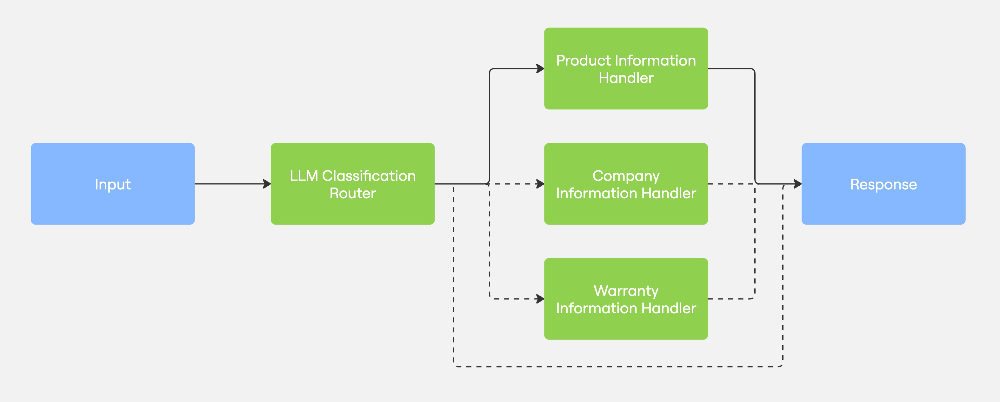

# Routing Pattern

## Overview

The Routing pattern directs user queries to specialized handlers based on the type of information requested. This pattern is useful when different types of queries require different data sources, models, or processing approaches. By classifying queries first, the system can provide more accurate and efficient responses.



## Implementation Details

This example demonstrates a routing pattern for a KETL Mtn. Apparel customer service chatbot:

1. **Query Classification** (`classify_query`): Analyzes the user query to determine its type (product, company, warranty, or unclear)
2. **Specialized Handlers**: Routes to different handler functions based on the classification:
   - `handle_product_query`: Processes product information requests using the product database
   - `handle_company_query`: Handles questions about KETL Mtn. as a company
   - `handle_warranty_query`: Provides information about warranty and repair services
3. **Response Formatting**: All handlers format responses consistently using KETL's brand voice

Each component is instrumented with OpenTelemetry tracing spans for comprehensive observability through Arize Phoenix.

## Key Components

### Classification Stage
- Analyzes query content and intent to determine the most appropriate handler
- Returns the query type, confidence score, and reasoning
- Uses lightweight prompts for efficient classification

### Specialized Handlers
- Each handler is optimized for a specific query type:
  - Product handler searches the product database
  - Company handler references company information
  - Warranty handler provides policy details
- All handlers maintain conversation context for follow-up questions

### Routing Logic
- The `process_customer_query` function orchestrates the routing flow
- Handles uncertainty by requesting clarification when needed
- Manages conversation history for context persistence

## Tracing and Observability

The implementation includes comprehensive OpenTelemetry tracing with Arize Phoenix integration:
- Parent span for the overall query processing
- Individual spans for classification and handler execution
- Key attributes recorded at each stage (query type, confidence score, response length)
- Clear visualization of the routing decision in trace views

## Usage

Run the example with the routing pattern:

```bash
python -m src.llm_composition_patterns.patterns.routing.example
```

The example includes a demonstration flow with sample queries for each handler type.

## Why This Pattern Matters

The Routing pattern is particularly valuable when:

- Different query types require specialized knowledge or data sources
- Query processing workflows vary significantly based on content
- System needs to handle a wide range of user intents
- Efficiency requires targeting specific resources for each query type

This pattern demonstrates how intelligent routing can lead to more accurate, efficient responses while maintaining clear observability through comprehensive tracing.

## Key Components

- **`example.py`**: Main implementation of the routing pattern
- **`ketlmtn_products.json`**: Product database with details about KETL Mtn. products
- **`about_us.txt`**: Information about KETL Mtn. as a company
- **`lifetime_guarentee.txt`**: Details about KETL Mtn.'s warranty and repair process
- **`brand_voice.txt`**: Guidelines for KETL Mtn.'s brand voice and tone
- **`message_types.py`**: Common message type definitions for LLM interactions
- **`groq_helpers.py`/`fireworks_helpers.py`**: Helper functions for interacting with LLM providers

## Features

- **Intelligent Routing**: Directs queries to the most appropriate handler
- **Resource Optimization**: Uses smaller models for simpler tasks, larger models for complex tasks
- **Conversation History**: Maintains context across multiple interactions
- **Contextual Clarification**: Provides helpful guidance when queries are unclear
- **Consistent Brand Voice**: All responses maintain the same brand voice

## Usage

```python
# Initialize conversation
conversation_history = []

# Process a customer query
response, conversation_history = process_customer_query(
    "What is your company's mission?", 
    conversation_history
)

# Process a follow-up question using the same conversation history
response, conversation_history = process_customer_query(
    "Do you have any sustainable products?", 
    conversation_history
)
```

## Benefits

- **Specialization**: Each handler can be optimized for specific types of queries
- **Efficiency**: Uses the most appropriate model and data source for each query type
- **Scalability**: Easy to add new handlers for additional query types
- **Maintainability**: Handlers can be updated independently
- **Cost Optimization**: Uses smaller, cheaper models when appropriate

## Limitations

- **Classification Errors**: Incorrect routing if the classifier misinterprets the query
- **Boundary Cases**: Some queries may span multiple categories
- **Latency**: Classification step adds an additional API call
- **Complexity**: More complex to implement than simpler patterns

## Example Interactions

### Product Query Example

```
User: "Do you have any lightweight hiking pants for summer?"

Step 1: Classifies as a product query
Step 2: Routes to product information handler
Step 3: Formats response in KETL Mtn.'s brand voice

Response: "Hey there, trail seeker! Our Vent Lightweight Active Pants are perfect for summer adventures. Super stretchy, breathable, and quick-drying, they come in Black, Grey, and Brown for $89.95. They've got zippered pockets and our signature anti-squish design for ultimate comfort on the trail!"
```

### Company Query Example

```
User: "What is your company's approach to sustainability?"

Step 1: Classifies as a company query
Step 2: Routes to company information handler
Step 3: Formats response in KETL Mtn.'s brand voice

Response: "At KETL, sustainability isn't just a buzzword—it's in our DNA! We're all about 'buy less, buy better' and back it up with our lifetime repair program. We fix rips, tears, and defects for free, keeping gear out of landfills. Our partnerships with ethical manufacturers ensure our products are made with the same love for adventure as we have!"
```

### Unclear Query Example

```
User: "Can you help me with something?"

Step 1: Classifies as an unclear query
Step 2: Generates clarification request
Step 3: Formats response in KETL Mtn.'s brand voice

Response: "Hey there, adventure buddy! I'd love to help, but I'm not quite sure what you're looking for. Could you let me know if you're asking about our rad gear, our company story, or our lifetime repair guarantee? Just point me in the right direction and I'll get you sorted!"
```

## Running the Example

To run the example:

1. Ensure you have the required dependencies:
   ```bash
   uv add groq python-dotenv
   ```

2. Set up your environment variables:
   ```bash
   # Create a .env file with your API key
   echo "GROQ_API_KEY=your_api_key_here" > .env
   ```